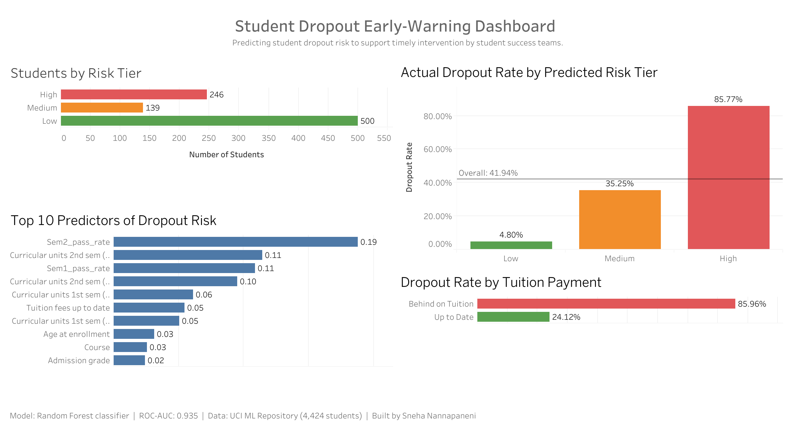

# Student Dropout Early-Warning Analytics

Predicting which higher-education students are at risk of dropping out, using only data available early in their academic journey, to support timely intervention by student success teams.

## Live Dashboard

[**View the interactive dashboard on Tableau Public**](https://public.tableau.com/views/StudentDropoutEarly-WarningDashboard/Dashboard1?:language=en-US&:sid=&:redirect=auth&:display_count=n&:origin=viz_share_link)



## Why This Project

Higher education institutions invest heavily in retention. The earlier a struggling student is identified, the more time advisors and faculty have to intervene. This project builds a data-driven early-warning system that flags at-risk students based on demographics, prior education, financial indicators, and first/second-semester academic performance.

## Dataset

[UCI Machine Learning Repository — *Predict Students' Dropout and Academic Success*](https://archive.ics.uci.edu/dataset/697/predict+students+dropout+and+academic+success) (Realinho et al., 2021)

- ~4,400 students from a Portuguese higher-education institution
- 36 features across demographics, socioeconomic background, prior academics, and first/second semester performance
- Programs include nursing, education, social services, management, and others
- License: CC BY 4.0

The original three-class target (Dropout / Enrolled / Graduate) is reframed as binary (Dropout vs Not Dropout) to match the operational framing of an early-warning system.

## Methodology

1. **Exploratory analysis** of demographic, financial, and academic patterns associated with dropout
2. **Feature engineering** including first- and second-semester pass rates
3. **Model comparison**: Logistic Regression baseline vs Random Forest
4. **Stratified train/test split** with class-balanced loss to handle class imbalance
5. **Risk-tier translation** of predicted probabilities into Low / Medium / High operational tiers
6. **Tableau dashboard** for stakeholder communication

## Results

| Model | ROC-AUC |
|---|---|
| Logistic Regression | 0.927 |
| **Random Forest (selected)** | **0.935** |

**Risk-tier validation on held-out test data:**

| Risk Tier | Actual Dropout Rate |
|---|---|
| Low | 4.80% |
| Medium | 35.25% |
| High | 85.77% |

A 17x lift between Low and High tiers demonstrates meaningful separation, supporting targeted intervention by student success teams.

**Top predictors:** Second-semester pass rate, second-semester credit completion, first-semester pass rate, tuition payment status, and admission grade.

Random Forest was selected as the final model for its balance of performance and interpretability. The small spread between Logistic Regression and Random Forest suggests the predictive signal in the data is strong and well-captured even by simpler linear approaches.

## Repository Structure

```
student-dropout-prediction/
├── 01_eda.ipynb                              # Exploratory data analysis
├── 02_modeling.ipynb                         # Model training and evaluation
├── data/
│   ├── raw_students.csv                      # Original UCI dataset
│   └── students_cleaned.csv                  # Cleaned data with engineered features
├── outputs/
│   ├── confusion_matrix.png                  # RF classification results
│   ├── roc_curves.png                        # Model comparison curves
│   ├── feature_importance.png                # Top predictors visualization
│   ├── feature_importance_for_tableau.csv    # Dashboard input
│   ├── test_predictions_for_tableau.csv      # Dashboard input
│   └── dashboard_screenshot.png              # Tableau dashboard preview
├── .gitignore
└── README.md
```

## Tools

- **Python:** pandas, NumPy, scikit-learn, matplotlib, seaborn
- **Visualization:** Tableau
- **Data source:** UCI ML Repository via the `ucimlrepo` package

## Run Locally

```bash
pip install ucimlrepo pandas numpy matplotlib seaborn scikit-learn jupyter
jupyter notebook
# Run 01_eda.ipynb first, then 02_modeling.ipynb
```

## Limitations & Next Steps

- The current model uses end-of-second-semester data. A true early-warning system would retrain on first-semester-only or pre-enrollment features for earlier prediction.
- Source data is from a single institution; generalization to other contexts would require local recalibration.
- The "Enrolled" students in the original three-class target are labeled as "Not Dropout" in the binary reframing — some may still drop out later, slightly polluting the negative class.
- Risk-tier thresholds are illustrative; production thresholds should be set based on intervention capacity.

## Citation

Realinho, V., Vieira Martins, M., Machado, J., & Baptista, L. (2021). *Predict Students' Dropout and Academic Success* [Dataset]. UCI Machine Learning Repository. https://doi.org/10.24432/C5MC89
